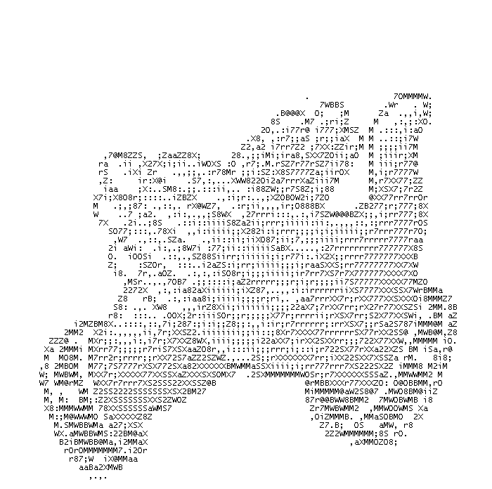

```{r setup, include=FALSE}
options(htmltools.dir.version = FALSE)
knitr::opts_chunk$set(echo = FALSE, fig.align = "center")
library(knitr);library(DT);library(dplyr);library(data.table);library(rmarkdown);library(readr);library(purrr);library(tidyr)
```


layout: true

<div class="my-footer"><span><a href="https://www.zarathu.com">Zarathu Co.,Ltd</a>   
&emsp;&emsp;&emsp;&emsp;&emsp;&emsp;&emsp;&emsp;&emsp;&emsp;&emsp;&emsp;&emsp;
&emsp;&emsp;&emsp;&emsp;&emsp;&emsp;&emsp;&emsp;&emsp;&emsp;&emsp;&emsp;&emsp;
<a href="https://github.com/jinseob2kim">김진섭</a></span></div> 


---
# Executive Summary 

* 18/19 세기 미적분학, 해석학의 발전으로, 수학은 점점 기존의 직관과 상식에서 벗어나 추상화되면서 많은 문제점들이 생겼다.

--

* 특히 무한의 개념을 엄밀하게 다룰 필요성이 있었는데, **칸토어(Georg Cantor)**는 집합론의 논법으로 무한을 엄밀하게 정의하고 그것들의 크기를 비교하였다.

--

* 20세기 수학자들은 집합론을 이용, 수학의 기초를 구성하고 모순이 없는 수학체계를 만들 수 있다는 꿈으로 부풀어 있었으나, [러셀의 역설(Bertrand Russel's paradox) ](https://namu.wiki/w/%EB%9F%AC%EC%85%80%EC%9D%98%20%EC%97%AD%EC%84%A4)로 대표되는 "**자기언급의 역설**"은 집합론의 기초를 위태롭게 하였다.

--

* **힐베르트(David Hilbert)**는 "자기언급의 역설" 은 **수학의 명제**와 **메타수학(meta-mathematics)의 명제**를 구분하지 않아 일어나는 것으로 판단하였으며, 이를 잘 구분하는 공리계를 세심하게 설계할 수만 있다면 모순없는 수학체계를 만들 수 있다고 보았다.


---

* **힐베르트(David Hilbert)**는 "자기언급의 역설" 은 **수학의 명제**와 **메타수학(meta-mathematics)의 명제**를 구분하지 않아 일어나는 것으로 판단하였으며, 이를 잘 구분하는 공리계를 세심하게 설계할 수만 있다면 모순없는 수학체계를 만들 수 있다고 보았다.


--

* 그러나 **괴델(Kurt Gödel)**은 이 부분을 파고들어 메타수학의 명제를 수학의 명제로 바꾸는 **괴델수(Gödel number)** 라는 독창적인 아이디어를 제안, 메타수학의 명제를 수학 체계로 갖고 온 후 자기언급의 역설을 보여주었다. 즉, "**자기언급의 역설**" 을 피하기 위해 아무리 세심하게 공리계를 설계해도 그것을 피할 수는 없다는 것을 증명하였으며, 이것이 불완전성 정리이다.  

--

* 불완전성 정리로 인해 "**참이지만 증명불가능한 명제가 존재**" 하고 나아가 "**수학의 무모순성을 수학 자체적으로는 증명할 수 없음**" 이 증명되어 모순없는 완전한 수학체계의 꿈은 결국 산산조각이 난다.

--

* 불완전성 정리를 **인간 이성의 한계**로만 해석하고 실의에 빠지지 말자. 어떤 기계보다도 더 **복잡하고 정교한 인간의 정신구조와 능력**을 긍정하며 **창조적 이성의 힘**을 인정할 때이다.


---

class: center, middle

# 수학의 추상화

---
# $\infty$

.large[
18/19 세기 미적분학, 해석학의 발달


* 수렴과 극한: 1 에 **무한**히 접근한다.


* 발산: **무한**히 커진다, 혹은 진동한다


**무한** $(\infty)$ 은 무엇일까? 
]


---
# 사칙연산 파괴

.large[
$$\infty + \infty = \infty$$ 


$$\infty - \infty = 0$$


$$\infty \times \infty = \infty$$
]

.large[이래도 되나?]

---
class: center, middle

.large[
**힐베르트 호텔**: 손님을 무한히 받을 수 있는 호텔?
]

<iframe width="700" height="420" src="https://www.youtube.com/embed/Uj3_KqkI9Zo" frameborder="0" allow="accelerometer; autoplay; encrypted-media; gyroscope; picture-in-picture" allowfullscreen></iframe>


---
# 교환법칙 성립?

.large[
$$1 + \infty = \infty$$ 


$$\infty + 1 \neq \infty$$

비유 

* 약간 기분 나쁠 때 ( 1 ) + 엄청 기분 나쁜일 ( $\infty$ ) 을 겪는다면? 

    + 기분이 엄청 나빠짐 ( $\infty$ )

* 엄청 기분 나쁠 때 ( $\infty$ ) + 약간 기분 나쁜일 ( 1 ) 을 겪는다면? 

    + 대형 사고 가능성 (무한보다 더 큰 무한?)

]

---
# 집합 크기 비교

.large[

* 홀수 < 자연수, 짝수 < 자연수?


* 자연수 < 정수?


* 자연수 < 유리수?


* 자연수 < 실수?
]

--
.large[> 대수학자 가우스마저 "**무한은 수학적 가치가 없다!**" 고 일갈]


---
class: center, middle

```{r}
include_graphics("https://gif.fmkorea.com/files/attach/new/20161129/486616/491814989/521876913/4d5dbfe7f949f2fa66c03650f32df721.gif")
```

---
# 추천도서

[](https://www.aladin.co.kr/shop/wproduct.aspx?ItemId=170464173)


---

class: center, middle

# 집합론: 무한의 엄밀한 정의

---
# 칸토어(Georg Cantor)의 집합론
.large[
무한의 크기를 비교하기 위해 **무한집합의 크기**를 정의.


* 정의 1: 자연수집합의 크기를 $\aleph_0$ 라 한다. 


* 정의 2: 두 집합에 **1:1 대응이 존재**한다면 두 집합의 크기는 **같다**.


> 자연수집합의 크기를 **셀 수 있는 무한**(가산무한) 이라 한다.
]


---

```{r}
include_graphics("https://upload.wikimedia.org/wikipedia/commons/thumb/f/ff/Aplicaci%C3%B3n_2_inyectiva_sobreyectiva04.svg/220px-Aplicaci%C3%B3n_2_inyectiva_sobreyectiva04.svg.png")
```

> **자연수의 갯수 = 짝수의 갯수**

--

```{r}
include_graphics("https://blogfiles.pstatic.net/MjAxODAxMThfMTg5/MDAxNTE2MjM4OTU0NTYz.rz0p9sLwc_NgV_7-0CQ48e4mGBX67hvJzT2h7okb89Eg.xS8Al2DSb-yB72IQmEBb7iwEmqmzIaJuhMyKoJh6ZVsg.PNG.duxogn08/%EA%B7%B8%EB%A6%BC4.png")
```

> **자연수의 갯수 = 정수의 갯수**

---
# 자연수의 갯수 = 유리수의 갯수

```{r}
include_graphics("https://t1.daumcdn.net/cfile/tistory/26240333547D6D7C11")
```

---
# 자연수의 갯수 < 실수의 갯수

.large[
[칸토어의 대각선 논법(Cantor's diagonal argument)](https://ko.wikipedia.org/wiki/%EB%8C%80%EA%B0%81%EC%84%A0_%EB%85%BC%EB%B2%95)


* **0과 1 사이의 실수** 집합이 **자연수** 집합보다 큼을 증명. 


* 귀류법- 1:1 대응이 존재함을 가정한 후, 대응이 존재하지 않는 새로운 실수를 제안. 

]


---

```{r}
include_graphics("https://image3.slideserve.com/5709447/slide20-n.jpg")
```

---
class: center, middle

.large[포켓몬 모으는 방법의 갯수는 자연수의 갯수보다 크다.]


<iframe width="700" height="420" src="https://www.youtube.com/embed/dEOBDIyz0BU" frameborder="0" allow="accelerometer; autoplay; encrypted-media; gyroscope; picture-in-picture" allowfullscreen></iframe>


---

# 실수집합의 크기

.large[
* 정의 4: 실수집합의 크기를 $|\mathbb R| = \aleph_1$ 라 한다. 


$$\aleph_1 > \aleph_0$$

> 실수보다 작고 자연수보다 큰 무한이 존재할까? **연속체 가설**
]

---

class: center, middle

# 자기언급의 역설

---
class: center, middle

.pull-left[
```{r, out.width="100%"}
include_graphics("https://image.aladin.co.kr/product/11328/50/cover500/8972916382_1.jpg")
```
]


.pull-right[
```{r, out.width="100%"}
include_graphics("https://misc.ridibooks.com/cover/2116000111/xxlarge")
```
]

---
# 집합론 good!!

.large[
* 20세기 수학자들은 집합론을 이용, 수학의 기초를 구성하고 모순이 없는 수학체계를 만들 수 있다는 꿈으로 부풀어 있었다.


* 그러나 정작 **"집합이란 무엇인가?"** 에 대해서는 깊게 생각하지 않았다.


> 그리고 온갖 역설이 발견된다.
]


---
# 거짓말쟁이 역설

```{r}
include_graphics("https://3.bp.blogspot.com/-Xk7t3-9VNF4/WsMEigQ2r_I/AAAAAAAAtUY/a_F8bETxDD8V9ddGWOmyIbg_YLG_fLGXwCLcBGAs/s1600/np-43-728.jpg")
```

"**이 문장은 거짓이다**"

---
# 이발사 역설 

```{r, out.width="60%"}
include_graphics("https://www.ebsmath.co.kr/innovativelrms/web_lrms/content/resource/PC//28412/1524014241952.PNG")
```


---
# M. Escher: 손을 그리는 손

```{r, out.width="70%"}
include_graphics("https://encrypted-tbn0.gstatic.com/images?q=tbn:ANd9GcTavA1zG6qfdC3zlHxnSu0dVKk_bQ2XOPWyjnIsq6xSWsqGvzsFhQ")
```


---
# 러셀의 역설

**"자신을 원소로 포함하지 않는 모든 집합들의 집합"** $M$은 자기 자신을 포함하는가?


```{r}
include_graphics("https://i.pinimg.com/originals/f5/47/67/f547671a11f0d782ae264bdce7750dc4.gif")
```

.large[자신을 원소로 포함하는 집합?]


---
# 자기언급의 역설 

> **"명제에 자기 자신을 언급하는 것"**이 역설의 원인이다.

.large[
* 이 문장은 거짓이다. 


* 자신을 원소로 포함하는 집합
]

--

> "**집합은 자기 자신을 원소로 갖을 수 없음**" 을 아예 공리로 정하자.


예) [ZFC 공리계](https://namu.wiki/w/ZFC%20%EA%B3%B5%EB%A6%AC%EA%B3%84?from=ZFC)


.large[
이 공리를 이용,  수학의 명제와 메타수학의 명제를 구분할 수 있다.
]


---

class: center, middle

# 수학과 메타수학

---
class: center, middle

```{r, out.width="50%"}
include_graphics("https://image.aladin.co.kr/product/802/16/cover500/8961390341_1.jpg")
```

---
# 메타수학이란?

$$1 + 1 =2$$

"**수학**" 에 대한 표현: 수학명제 


$$``1 + 1 = 2" \text{ 이다.}$$

"**수학명제**" 에 대한 표현: 메타수학의 명제


* 메타수학의 명제 예시 

    + $x$는 변수이다. 
    
    + $``x = 1"$  은 방정식이다.


---
# 거짓말쟁이 역설은 수학이 아님.

> 이 명제는 거짓이다. 

.large[
"수학명제" 에 대한 표현이므로 메타수학의 명제이다. 즉, 수학명제로 인정하지 않는다.
]

--

```{r, out.width="50%"}

```

---
# 자기언급의 역설은 해결?

.large[
힐베르트: 이제는 수학의 무모순성을 증명할 수 있을 것이라 낙관하고, [20세기에 해결해야할 23가지 문제](https://ko.wikipedia.org/wiki/%ED%9E%90%EB%B2%A0%EB%A5%B4%ED%8A%B8_%EB%AC%B8%EC%A0%9C)에 이를 포함시킴. 
]

--
.large[

문제 1. **연속체 가설**: 자연수보다 크고 실수보다 작은 집합은 존재하지 않는다. 


문제 2. **수학의 무모순성**: 산술의 공리들이 무모순임을 증명하라.

]


---

class: center, middle

# 괴델수: 메타수학을 수학으로


---
# 메타수학도 결국 수학이다.

.large[
괴델은 **메타수학과 수학이 딱 구분될 수 없음**을 설명함.

* "메타수학의 명제에 대응하는 수학명제가 존재함" 을 증명. 
]


--
.large[
**괴델수(Gödel number)** 라는 엄청난 아이디어가 도입됨.

* 모든 수학기호, 변수, 명제, 명제묶음(증명) 에 유일한 숫자를 부여.


* 모든 메타수학의 명제를 괴델수를 이용, 수학명제로 바꿀 수 있다. 
]


---
# 괴델수: 기호 

.small[
|기호 | 괴델수 | 의미|
| ---:|:------:|:----:|
| $\sim$ | 1 | 아니다| 
| $\vee$ | 2 | 또는  |
| $\supset$ | 3 | $\cdots$라면 $\cdots$다|
| $\exists$ | 4 | $\cdots$이 존재한다 |
| $=$ | 5 | 같다 |
| 0 | 6 | 영(0) |
| $s$ | 7 | 바로 다음 수| 
| ( | 8 | 왼쪽 괄호|
| ) | 9 | 오른쪽 괄호|
| , | 10 | 쉼표 |
| $+$ | 11 | 더하기|
| $\times$ | 12 | 곱하기|
]


---
# 괴델수: 변수, 문장/술어 변항

| |변항 |괴델수 | 대입 예 |
|-----:|:-----:|:------:|:-------:|
|변수| $x$ | 13 | 0 |
| | $y$ | 17 | $s0$ | 
| | $z$ | 19 | $y$|
|문장 변항 | $p$ | $13^2$ | $0=0$ |
| | $q$ | $17^2$ | ( $\exists$ x)( $x=sy$ ): $y$의 다음 수 $x$가 존재한다. |
| | $r$ | $19^2$ | $p\supset q$ |
|술어 변항 | $P$ | $13^3$ | $P(x)$: $x$는 소수이다. |
| | $Q$ | $17^3$ |  |
| | $R$ | $19^3$ | |

---
# 예시

2를 괴델수로 표현한다면?

--

* $ss0$: 0의 다음다음 수.

--

"** $y$ 다음 수가 존재한다**" 를 괴델수로 표현하면?

--

* ( $\exists x$ )( $x=sy$ )


* 기호 하나하나의 괴델수를 살펴보면 8, 4, 13, 9, 8, 13, 5, 7, 17, 9


* 문장의 괴델수는 

$$ 2^8 \times 3^4 \times 5^{13} \times 7^9 \times 11^8 \times 13^{13} \times 17^5 \times 19^7 \times 23^{17} \times 29^9 $$
---
# 증명의 괴델수 

증명이 2문장, 즉 2개의 명제로 이루어졌고 그것의 괴델수가 각각 $m, n$ 이라면 

$$ 2^m \times 3^n $$

가 증명의 괴델 수이다. 

--
```{r, out.width="50%"}

```

---
# 괴델 수 해석

괴델 수 $243,000,000$

$$ 243,000,000 = 2^6 \times 3^5 \times 5^6 $$

--
6은 "0의 괴델수", 5는 " $=$ 의 괴델수"

> " $0 = 0$" 이라는 명제.

--

```{r, out.width="50%"}

```

---
# 메타수학의 수학화

수학명제 "**0은 0이 아니다.**" 즉, $``\sim(0=0)"$ 의 **괴델수를 $a$** 라 하자. 


메타수학명제

$$``\sim(0=0)" \text{의 첫 번째 기호는 틸드}(\sim) \text{이다}.$$

는 다음의 과정을 거쳐 수학명제로 바뀐다.

--

> **괴델수 $a$ 인 명제의 첫번째 기호는 틸드( $\sim$ ) 이다.** 틸드( $\sim$ )의 괴델수는 1 이므로

> ** $a = 2^1 \times \cdots$ 꼴이다.**

> ** $a$ 는 2로 나누어지지만, $2^2$ 으로는 나누어지지 않는다**

> $(\exists z) (sss\cdots sss0=z\times ss0) \cdot \sim(\exists z) (sss\cdots sss0=z\times (ss0 \times ss0))$

( $sss\cdots sss0$ 에서 $s$ 는 정확히 $a$ 번 나타난다.)


---

class: center, middle

# 모든 메타수학의 명제에 대해, 대응하는 수학명제와 그 괴델수를 찾을 수 있다.


---
# 지금까지 흐름

.large[
* **메타수학**과 **수학**을 구분하면 **자기언급의 역설**을 피할 수 있다. 


* **괴델수**를 이용, **메타수학**의 명제를 **수학**의 명제로 바꿀 수 있다.


* **메타수학**과 **수학**, 구분할 수 있는 거 맞어???
]

```{r, out.width="50%"}
include_graphics("https://media.giphy.com/media/3o7bu4AogEOUDvil4Q/giphy.gif")
```


---

class: center, middle

# 불완전성 정리 증명

---
# 불완전성 정리

.large[
(아무리 공리를 세심하게 설계하여 메타수학과 수학을 구분하더라도)
]

--

* 제 1 불완전성 정리 

> **참이지만 증명 불가능한 명제가 존재한다.**

--

* 제 2 불완전성 정리

> **수학 공리계의  무모순성을 증명할 수 없다.**


본 강의에서는 제 1 불완전성 정리만 살펴보겠다.


---
# 증명 시도 

간단히 될 것 같다.

$$ G: G \text{는 증명 불가능하다.} $$

* 만약 $G$ 가 **증명 가능**하다면: $G$ 는 **참**인 명제로 그 뜻은 **$G$는 증명 불가능하다.** 모순

* 따라서 $G$ 는 **증명 불가능**한 명제 & 그 내용은 ** $G$는 증명 불가능하다.** 로 **참**이다.

> $G$ 는 참이지만 증명 불가능한 명제. 찾았다!!

--

.large[
그러나 이것은 자기자신을 언급한 **메타수학**의 명제임. 수학적 접근 안됨.
]

--

.large[
> 그러나 **괴델수**가 등장한다면 어떨까?
]


---
# 증명의 흐름

$G$를 메타수학의 명제

$$``\textbf{괴델수 } g \textbf{ 를 갖는 명제}" \text{ 는 증명 불가능하다.}$$

에 **대응하는 수학명제**라 하자. 만약 이 수학명제 $G$의 괴델수가 $g$ 라면?

--
* 수학명제 $G$가 증명 가능하다면

    + **괴델수 $g$ 를 갖는 명제** 는 증명 가능
    
    + $G$는 참이 되고 그 메타수학적 의미도 참 $\rightarrow$ **괴델수 $g$ 를 갖는 명제** 는 증명 불가능
    
    + 모순


* 수학명제 $G$ 가 증명 불가능하다면

    + **괴델수 $g$ 를 갖는 명제** 는 증명 불가능 $\rightarrow$ $G$ 내용 자체이므로 $G$는 참.


**G**는 참이지만 증명 불가능하다!!

---

class: center, middle

# 이런 G와 g가 존재?


---

class: center, middle

# 주의: 실제 증명은 훨씬 엄밀한 논리를 따른다. 


---
# 필요한 개념: Sub/sub

**Sub**( $x$ , 17, $x$ )를 다음과 같이 정의한다.

> **괴델수 $x$ 를 가진 문장**에 등장하는 **변수 $y$ 들에 전부 숫자 $x$ 를 대입**해서 만들어진 명제.


**sub**( $x$ , 17, $x$ )은 그것의 괴델수로 정의한다.

> **Sub**( $x$ , 17, $x$ ) 의 괴델수

(참고: 변수 $y$의 괴델수는 17)

---
# 예시

> $y$ 다음 수가 존재한다.

$$(\exists x)(x=sy)$$  

괴델수 $k$ 는 

$$k=2^8 \times 3^4 \times 5^{13} \times 7^9 \times 11^8 \times 13^{13} \times 17^5 \times 19^7 \times 23^{17} \times 29^9$$

--
**sub**( $k$ , 17, $k$ ): 원래 문장의 변수 $y$에 그 문장의 괴델수인 $k$를 대입한 명제의 괴델수는  

$$2^8 \times 3^4 \times \cdots \times 19^7 \times 23^{7} \times 29^7 \times 31^7 \times 37^7 \times \cdots (P_{k+10})^9$$

* $k = ss\cdots s0$ ( $s$는 $k$번 나옴). 

* $y$ 부분에 해당되는 $23^{17}$부터 $s$로 바뀜. 

* $P_{k+10}$: $k+10$번 째 소수.


---
# G와 g를 찾자

변수 $y$를 포함한 메타수학의 문장 "**괴델수 $y$를 갖는 명제의 변수 ' $y$' 에 숫자 $y$를 대입한 명제는 증명불가능하다.**" 즉,


> **Sub( $y$ ,17, $y$) 은 증명불가능하다** 

을 표현하는 수학적 형식문의 괴델수를 $n$이라 하자. 이제 $G$를 

--
$$``\textbf{괴델수 sub} (n, 17, n) \textbf{ 을 갖는 명제}" \text{ 는 증명 불가능하다.}$$

을 표현한 수학적 형식문(변수가 없으므로 명제)이라 정의하자. $G$의 괴델수 $g$는 무엇일까? 

--

> $g$ = **sub**( $n$, $17$, $n$ ), Why?

$G$ 는 **괴델수 $n$ 를 가진 문장**을 표현한 형식문

> **Sub( $y$ ,17, $y$) 은 증명불가능하다** 

에 등장하는 **변수 $y$ 들에 전부 숫자 $n$ 를 대입**해서 만들어진 형식문(명제)!!


---
# G와 g를 찾았으므로 증명끝!

$$``\textbf{괴델수 } g \textbf{ 를 갖는 명제}" \text{ 는 증명 불가능하다.}$$

에 **대응하는 형식문(수학명제) $G$의 괴델수가 $g$** 라면?


* 수학명제 $G$가 증명 가능하다면

    + **괴델수 $g$ 를 갖는 명제** 는 증명 가능
    
    + $G$는 참이 되고 그 메타수학적 의미도 참 $\rightarrow$ **괴델수 $g$ 를 갖는 명제** 는 증명 불가능
    
    + 모순


* 수학명제 $G$ 가 증명 불가능하다면

    + **괴델수 $g$ 를 갖는 명제** 는 증명 불가능 $\rightarrow$ $G$ 내용 자체이므로 $G$는 참.


$G$는 참이지만 증명 불가능하다!!

---

```{r, out.width="80%"}
include_graphics("https://www.dogdrip.net/dvs/b/i/17/03/21/18564339/384/192/123/0e81b75d584094d55416164e6779d16c.gif")
```


---

class: center, middle

# 그 후

---
# 힐베르트의 꿈은 박살난다.


.large[
* 제 2 불완전성 정리 까지 증명되며, **수학 산술체계의 무모순성**(힐베르트 23문제 중 2번 문제)에 대한 힐베르트의 꿈은 박살난다. 


* 게다가, 하필이면 **연속체 가설**(힐베르트 1번 문제)이 결정불가능한 명제로 밝혀졌다.
]

```{r, out.width="40%"}
include_graphics("https://contents.vryjam.com/DHXPwibJ7sCZtP9.gif")
```

---
# 제 2 불완전성 정리 증명 소개

제 1 불완전성 정리

> **(C)** 산술체계가 무모순이면, **(G)** 괴델수 $g$를 갖는 명제는 증명 불가능하다.

[의 모든 증명 과정을 **형식화**](http://www.michaelbeeson.com/teaching/StanfordLogic/Lecture15Slides.pdf) 할 수 있다. 즉 


> "**(C) 산술체계가 무모순이면, (G) 괴델수 $g$를 갖는 명제는 증명 불가능하다.**" 는 증명 가능하다.  


만약 **(C)**가  증명가능하다면 즉, 산술체계가 무모순임을 증명할 수 있다면

* "**(C)이면 (G)이다**" 가 증명 가능하므로, **(G)** 도 증명 가능하다.


* 그러나 **(G)**는 괴델수 $g$를 갖는 명제로 증명이 불가능하다(by 1정리). 모순.


* 따라서 **(C)**는 증명 불가능 즉, **산술체계가 무모순임을 증명할 수 없다.**


---
# 힐베르트 학파의 대응: 증명개념의 확장

.large[
**무한한 단계를 가진 절차에 의한 증명도 허용**한다면, 수학의 산술체계가 무모순임을 보임.

* 힐베르트 프로그램의 처음 목표는 아님.
 ]

---
# 인간 이성의 한계?

.large[
20세기 초, 다양한 분야에서 인간 이성에 회의가 일어남

* **프로이트**: **무의식**이 의식보다 더 중요하다. 


* **괴델**: 수학의 무모순성을 증명할 수 없다.


* **하이젠베르크**: **위치**와 **운동량**을 동시에 정확히 측정할 순 없다(불확정성 원리)
]

---
# 계산기의 한계: 앨런 튜링 

.large[
불완전성 정리의 컴퓨터 버전

* 명제의 증명가능성 $\rightarrow$ 계산기의 실현 가능성

> 유한개의 명령에 따라 작동하는 기계는, 아무리 정교한 명령체계를 설계하고 연산속도를 올리더라도, 해결할 수 없는 문제가 존재한다.
]

---
# 인간 창의력에 대한 긍정적 해석

.large[
> 인간 지성이 가진 창의력은 완전히 형식화되지 않았고, 그렇게 될 수도 없다.


인간의 정신 구조와 능력은, 상상할 수 있는 어떤 기계보다도 더 복잡하고 정교하다. 실의에 빠질 떄가 아니라, 창조적 이성의 힘을 인정할 때!
]


---
# Executive Summary 


* 18/19 세기 미적분학, 해석학의 발전으로, 수학은 점점 기존의 직관과 상식에서 벗어나 추상화되면서 많은 문제점들이 생겼다.


* 특히 무한의 개념을 엄밀하게 다룰 필요성이 있었는데, **칸토어(Georg Cantor)**는 집합론의 논법으로 무한을 엄밀하게 정의하고 그것들의 크기를 비교하였다.


* 20세기 수학자들은 집합론을 이용, 수학의 기초를 구성하고 모순이 없는 수학체계를 만들 수 있다는 꿈으로 부풀어 있었으나, [러셀의 역설(Bertrand Russel's paradox) ](https://namu.wiki/w/%EB%9F%AC%EC%85%80%EC%9D%98%20%EC%97%AD%EC%84%A4)로 대표되는 "**자기언급의 역설**"은 집합론의 기초를 위태롭게 하였다.


* **힐베르트(David Hilbert)**는 "자기언급의 역설" 은 **수학의 명제**와 **메타수학(meta-mathematics)의 명제**를 구분하지 않아 일어나는 것으로 판단하였으며, 이를 잘 구분하는 공리계를 세심하게 설계할 수만 있다면 모순없는 수학체계를 만들 수 있다고 보았다.


---


* 그러나 **괴델(Kurt Gödel)**은 이 부분을 파고들어 메타수학의 명제를 수학의 명제로 바꾸는 **괴델수(Gödel number)** 라는 독창적인 아이디어를 제안, 메타수학의 명제를 수학 체계로 갖고 온 후 자기언급의 역설을 보여주었다. 즉, "**자기언급의 역설**" 을 피하기 위해 아무리 세심하게 공리계를 설계해도 그것을 피할 수는 없다는 것을 증명하였으며, 이것이 불완전성 정리이다.  


* 불완전성 정리로 인해 "**참이지만 증명불가능한 명제가 존재**" 하고 나아가 "**수학의 무모순성을 수학 자체적으로는 증명할 수 없음**" 이 증명되어 모순없는 완전한 수학체계의 꿈은 결국 산산조각이 난다.


* 불완전성 정리를 **인간 이성의 한계**로만 해석하고 실의에 빠지지 말자. 어떤 기계보다도 더 **복잡하고 정교한 인간의 정신구조와 능력**을 긍정하며 **창조적 이성의 힘**을 인정할 때이다.


---

class: center, middle

# END


